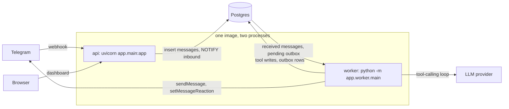

# Architecture

One container image runs as two processes that talk only through Postgres.



(The same diagram lives in [diagrams/architecture.mmd](diagrams/architecture.mmd).)

- **api** is stateless. It verifies and stores webhooks, serves the dashboard, and returns fast.
- **worker** does everything slow: model calls, transcription, sends.
- **Postgres is the source of truth.** The agent reads and writes only through tools, and tools
  only through `app/services/`.

## Design principles

1. Postgres is the source of truth.
2. LLM for language, code for rules. Finished staple to the list, bought to restocked: code.
3. Approximate beats absent. Quantities are optional everywhere.
4. Quiet by default. A reaction instead of a reply.
5. Idempotent everywhere. Every webhook may arrive twice.
6. Everything is undoable.
7. Nothing leaves the household. The router only sends to the household's own threads and handles.

## Three types carry every message

Defined in `app/core/envelope.py`. No module outside `app/channels/` knows a provider payload shape.

| Type | Produced by | Meaning |
| --- | --- | --- |
| `InboundEvent` | a channel adapter | Channel-shaped facts: who, where, text, media, reaction |
| `Envelope` | the inbound pipeline | What the agent reads: one thread's debounced batch as text |
| `OutboundMessage` | anything that wants to send | A row in `outbox`; target is a thread, a member or the household |

## Message flow

**Webhook (api, `app/main.py`, `app/pipeline/inbound.py`).** Verify, parse, and for each event:
look up the sender in `channel_identities`. An unknown sender stores nothing and gets no reply,
unless the whole message is an invite code. A known sender's thread is upserted, the first group
thread becomes the household's primary thread, and the message is inserted with
`ON CONFLICT (thread_id, external_id) DO NOTHING`, then `NOTIFY inbound`. A bad payload is logged
and answered 200; a database error returns 503 so the provider retries.

**Processing (worker, `inbound.process_household`).** A household is ready when its newest
unprocessed message is older than `DEBOUNCE_SECONDS`, which batches "out of eggs", "and bread",
"oh and milk" into one turn. The worker then, in one transaction:

1. takes `pg_advisory_xact_lock(hashtext(household_id))`, so two messages never race on stock;
2. claims the household's `received` messages (`FOR UPDATE SKIP LOCKED`);
3. answers the exact keyword `dashboard` with a login link, without the agent;
4. for each thread: transcribes voice notes, builds the `Envelope`, runs the agent turn;
5. queues the response: nothing for `NOOP`, an `ack` reaction for `ACK`, otherwise the reply text
   (as a reply to the last message when the batch had more than one);
6. marks the messages `processed` and stores usage, tool calls and latency in `messages.meta`.

Each thread's turn runs in a savepoint. If the turn fails (for example the model is down), the
savepoint rolls back so nothing is half-recorded, the messages become `failed`, and the thread
gets "Sorry, that didn't go through, try again?" once. Within a turn each tool call has its own
savepoint, so a failing tool does not undo an earlier one. See [ADR 0009](adr/0009-one-transaction-per-turn.md).

**Sending (worker, `app/pipeline/router.py`).** Every send is an `outbox` row inserted in the
writer's transaction, so a rolled-back turn sends nothing. The dispatcher takes due rows with
`FOR UPDATE SKIP LOCKED`, resolves the destination, sends, stores an `out` row in `messages`, and
on failure backs off 10 s, 30 s, 2 min, 10 min, 30 min before marking the row `failed`.

Destinations come only from the database:

| Target | Resolves to |
| --- | --- |
| `thread` | That thread, if it belongs to the household. A DM thread must also match a verified member handle |
| `member` | The member's preferred-channel identity, then telegram, whatsapp, imessage |
| `household` | The primary thread if set, else one send per adult |

A row with no allowed destination is marked `failed` and never sent.

## Repo layout

```text
app/
  main.py        create_app(): webhook route, health, dashboard routers
  config.py      Settings, logging
  db.py          engine, tx(), advisory lock, query helpers
  core/          envelope types, identity and invite codes, time
  llm/           neutral types, OpenAI-compatible and Anthropic adapters, speech-to-text
  channels/      ChannelAdapter protocol, registry, Telegram
  pipeline/      inbound (persist, debounce, turn, simulate_turn), media, router
  agent/         runtime interface, loop, prompt, resolve, actions (undo), stock, tools/
  services/      the one write path, shared by tools and dashboard
  dashboard/     auth, routes, templates, static
  worker/        supervisor and jobs
tests/           unit/ contract/ evals/
```

## Not built yet

Quiet-hours deferral, the WhatsApp 24-hour window, falling back to a member's next channel after a
failed send, and `MediaStore` arrive with the milestones that need them (reminders, WhatsApp,
iMessage, photos). The router sends every due row immediately today; replies set
`respect_quiet_hours = false` so that stays correct once deferral exists.
