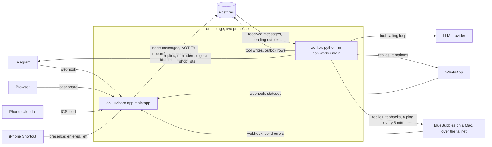

# Architecture

One container image runs as two processes that talk only through Postgres.



(The same diagram lives in [diagrams/architecture.mmd](diagrams/architecture.mmd).)

- **api** is stateless. It verifies and stores webhooks and presence pings, serves the dashboard
  and the calendar feed, and returns fast.
- **worker** does everything slow or timed: model calls, transcription, sends, reminders, digests.
- **Postgres is the source of truth.** The agent reads and writes only through tools, and tools
  only through `app/services/`.

## Design principles

1. Postgres is the source of truth.
2. LLM for language, code for rules. Finished staple to the list, bought to restocked: code.
3. Approximate beats absent. Quantities are optional everywhere.
4. Quiet by default. A reaction instead of a reply.
5. Idempotent everywhere. Every webhook may arrive twice.
6. Everything is undoable.
7. Nothing leaves the household. The router only sends to the household's own threads and handles.

## Three types carry every message

Defined in `app/core/envelope.py`. No module outside `app/channels/` knows a provider payload shape.

| Type | Produced by | Meaning |
| --- | --- | --- |
| `InboundEvent` | a channel adapter | Channel-shaped facts: who, where, text, media, reaction |
| `Envelope` | the inbound pipeline | What the agent reads: one thread's debounced batch as text |
| `OutboundMessage` | anything that wants to send | A row in `outbox`; target is a thread, a member or the household |

## Message flow

**Webhook (api, `app/main.py`, `app/pipeline/inbound.py`).** Verify, parse, and for each event:
look up the sender in `channel_identities`. An unknown sender stores nothing and gets no reply,
unless the whole message is an invite code. A known sender's thread is upserted, the first group
thread becomes the household's primary thread, and the message is inserted with
`ON CONFLICT (thread_id, external_id) DO NOTHING`, then `NOTIFY inbound`. A bad payload is logged
and answered 200; a database error returns 503 so the provider retries.

A webhook can also carry things that are not messages (`adapter.parse_updates`). A WhatsApp
`failed` delivery status marks the send it names as failed, and the outcome of a group creation
finishes or drops the request made on the Channels page. Both are handled in the api process.

**Processing (worker, `inbound.process_household`).** A household is ready when its newest
unprocessed message is older than `DEBOUNCE_SECONDS`, which batches "out of eggs", "and bread",
"oh and milk" into one turn. The worker then, in one transaction:

1. takes `pg_advisory_xact_lock(hashtext(household_id))`, so two messages never race on stock;
2. claims the household's `received` messages (`FOR UPDATE SKIP LOCKED`);
3. answers the exact keyword `dashboard` with a login link, without the agent;
4. for each thread: fetches each attachment once, stores it through `MediaStore` and transcribes
   voice notes, then builds the `Envelope` and runs the agent turn;
5. queues the response: nothing for `NOOP`, an `ack` reaction for `ACK`, otherwise the reply text
   (as a reply to the last message when the batch had more than one);
6. marks the messages `processed` and stores usage, tool calls and latency in `messages.meta`.

Each thread's turn runs in a savepoint. If the turn fails (for example the model is down), the
savepoint rolls back so nothing is half-recorded, the messages become `failed`, and the thread
gets "Sorry, that didn't go through, try again?" once. Within a turn each tool call has its own
savepoint, so a failing tool does not undo an earlier one. See [ADR 0009](adr/0009-one-transaction-per-turn.md).

**Sending (worker, `app/pipeline/router.py`).** Every send is an `outbox` row inserted in the
writer's transaction, so a rolled-back turn sends nothing. The dispatcher takes due rows with
`FOR UPDATE SKIP LOCKED`, resolves the destination, sends, stores an `out` row in `messages`, and
on failure backs off 10 s, 30 s, 2 min, 10 min, 30 min before marking the row `failed`. A failure
that cannot succeed on a retry (`PermanentError`) is marked `failed` at once.

Destinations come only from the database:

| Target | Resolves to |
| --- | --- |
| `thread` | That thread, if it belongs to the household. A DM thread must also match a verified member handle |
| `member` | The member's preferred-channel identity, then telegram, whatsapp, imessage; a degraded channel comes last |
| `household` | The primary thread if set and its channel is not degraded, else one send per adult |

A row with no allowed destination is marked `failed` and never sent.

**The WhatsApp window.** WhatsApp takes free-form text only within 24 hours of the other side's
last message. Before a text send on a channel with `proactive_window_hours`, the dispatcher looks
up when that thread was last heard from: its newest inbound message, or for a DM the moment the
member connected, whichever is later. If that is 24 hours ago or more, the text goes out inside
the approved template instead, flattened to one line of at most 900 characters. Reactions are
never wrapped. See [ADR 0020](adr/0020-whatsapp-window-and-template.md).

**The next channel.** When a text to one person has failed for good (refused outright, out of
retries, or reported undelivered by a later WhatsApp status), the dispatcher queues it once more,
to that member's DM on their next connected channel in the order Telegram, WhatsApp, iMessage. The
second try never falls back again. Group sends and reactions do not move. See
[ADR 0022](adr/0022-permanent-failures-and-the-next-channel.md).

**A degraded channel.** iMessage runs through a Mac that can go away. The worker pings it every
five minutes and marks the adapter degraded while it does not answer. The dispatcher then picks
each member's next identity before trying, sends a text that was waiting for an iMessage DM to
its owner's next channel, and gives each adult what was meant for an iMessage family group.
Acks, group sends and people with no other channel stay where they are and are retried. See
[ADR 0028](adr/0028-a-degraded-channel-and-the-next-identity.md).

**Quiet hours.** Each member has a quiet window, 21:30 to 07:00 by default; a window whose start
is later than its end crosses midnight. Before a send, the dispatcher asks whether the recipient
is inside theirs. If so the row is not sent: its `send_after` moves to the end of the window and
it is picked up again then. A send to a group waits while any adult is in quiet hours. Two kinds
of row are never held: `urgency = 'high'`, and rows with `respect_quiet_hours = false`, which is
what direct replies, invite welcomes and login links use. See
[ADR 0012](adr/0012-quiet-hours-and-reminder-delivery.md).

**Media (`app/media/`, `app/pipeline/media.py`).** `MediaStore` has `put`, `get` and `delete`,
with an S3-compatible backend and an ImgBB backend chosen by `MEDIA_BACKEND`. The pipeline and
the agent only ever see a `MediaRef`. S3 keeps images and audio in a private bucket at
`{household}/{message_id}/{n}.{ext}`. ImgBB keeps images only, behind an unlisted public URL, and
never audio. Attachments are stored before the turn's savepoint, so a failed turn still leaves a
reference that retention can delete. Up to four photos per turn are loaded back through the store
and sent to the model inline, so the provider never sees a storage URL. With no backend
configured, a failed fetch, or a model without image input, the turn carries a one-line note
instead and still runs. See [ADR 0018](adr/0018-media-retention-and-photos-without-a-backend.md).

## Presence

`POST /presence/{token}` is the third way into the api, after webhooks and the dashboard. An iOS
Shortcut on each adult's phone calls it with `enter` or `exit` and a place name. The api stores
the ping and runs one rule in code (`app/presence/rules.py`): arriving at a shop queues that
person the list for that shop, leaving home with a long or freshly changed list queues an offer
of it. Like everything else the api does, it only writes rows; the worker's outbox sends them.
Every nudge is claimed in `nudge_log` first, so a doubled or replayed ping sends nothing twice.
Phone setup and the rules are in [presence.md](presence.md).

## Scheduled jobs

The worker runs each job as its own supervised task (`app/worker/jobs.py`). Every job takes the
current time as an argument, so tests drive them on a controlled clock.

| Job | Every | What it does | Why a second run is harmless |
| --- | --- | --- | --- |
| `inbound` | NOTIFY, or 2 s | Turns, as above | Messages are claimed with `SKIP LOCKED` under the household lock |
| `outbox` | 2 s, or when woken | Sends due rows | `SKIP LOCKED`; a sent row is no longer pending |
| `fire_reminders` | 15 s | Due reminders become outbox rows. A one-off becomes `sent`; a repeating one moves to its next time | `SKIP LOCKED`, and the outbox dedupe key is `reminder:{id}:{fire_at}` |
| `expand_recurrence` | 1 h | Reminder rows for each recurring event's occurrences in the next 48 hours, skipping exception dates | Unique `(event_id, fire_at)` |
| `daily_brief` | 1 min check | At the household's `digest_time`: today's events and reminders, items to use within 2 days. Nothing on an empty day | A `job_runs` row per household and date |
| `weekly_digest` | 1 min check | Sunday 18:00: the week ahead, the list count, low and expiring items, and what will probably run low that week | A `job_runs` row per household and ISO week |
| `consumption_model` | 1 min check | Once a day from 03:00: relearns each item's run-out interval, refreshes the list's "probably" entries, then fills missing item categories in one model call per household | A `job_runs` row per household and date; the refresh is idempotent |
| `low_stock_prompt` | 1 min check | 17:30: asks the household about items predicted to run out within 2 days that nobody was asked about in the last 3 | A `job_runs` row per household and date, and a `nudge_log` row per item |
| `imessage_health` | 5 min, only with iMessage set up | Pings BlueBubbles; sets or clears the adapter's degraded flag; tells each affected household's admin once per outage | A `nudge_log` row per household for the length of the outage |
| `media_cleanup` | 1 h, only with a media backend | Deletes stored media on messages older than `MEDIA_RETENTION_DAYS` and drops the storage fields; text and transcripts stay | `SKIP LOCKED`; a cleaned message no longer matches |

A reminder is sent within about 17 seconds of its `fire_at` (15 s tick, then the outbox, which the
job wakes). A digest missed by more than four hours is skipped instead of being sent late. After
an outage, a reminder is dropped rather than sent if a later reminder for the same event is also
due, or if the event began more than ten minutes ago.

## Repo layout

```text
app/
  main.py        create_app(): webhook route, health, dashboard and feed routers
  config.py      Settings, logging
  db.py          engine, tx(), advisory lock, query helpers
  core/          envelope types, identity and invite codes, time, quiet hours, recurrence
  llm/           neutral types, OpenAI-compatible and Anthropic adapters, the two subscription
                 adapters that run the vendors' CLIs, speech-to-text
  media/         MediaStore protocol and factory, S3 and ImgBB backends
  channels/      ChannelAdapter protocol, registry, Telegram, WhatsApp, iMessage
  pipeline/      inbound (persist, debounce, turn, simulate_turn), media (fetch, store, transcribe), router
  agent/         runtime interface and factory, loop, the optional Letta runtime and its tool bridge,
                 prompt, resolve, actions (undo), stock, tools/
  services/      the one write path, shared by tools and dashboard
  dashboard/     auth, routes, templates, static
  ics/           the read-only calendar feed
  presence/      the Shortcut endpoint and its rules
  worker/        supervisor and jobs
deploy/helm/     the chart
tests/           unit/ contract/ evals/
```

## Deploying

`deploy/helm/household-agent/` is the chart: the api and the worker as two Deployments of the one
image ([operations.md](operations.md#deploying-with-helm)).
