# Dashboard

A phone-first web dashboard at `/dashboard`, rendered by the api process with Jinja2 and HTMX.
It is for setup, looking things over and fixing mistakes; daily use happens in chat.

  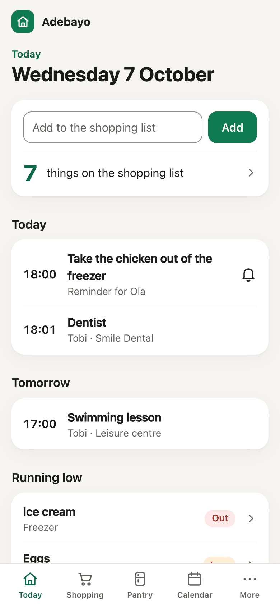
  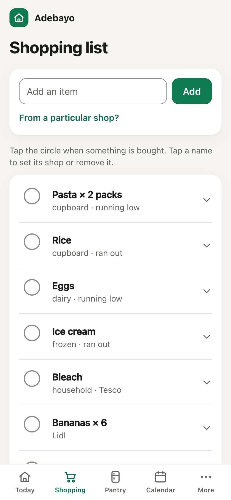
  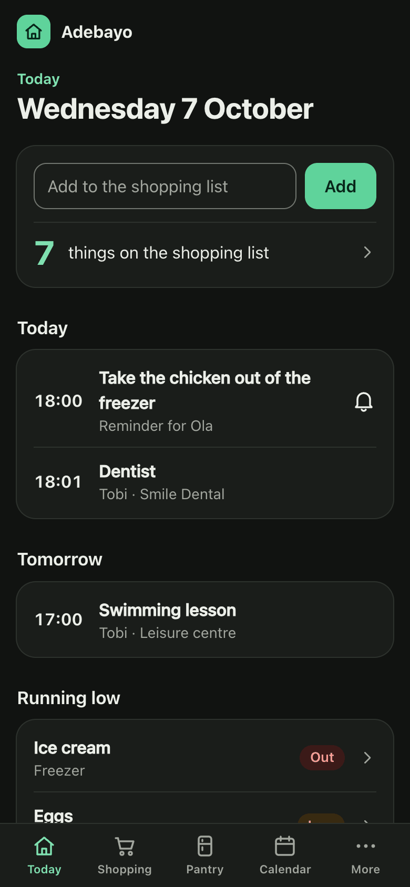

## How it looks

A phone has four tabs along the bottom, Today, Shopping, Pantry and Calendar, and a fifth, More,
that opens a page listing the rest: Family, Chat apps, Settings, Activity, Practice chat, System
(admins only) and Log out. From 960 px wide the tabs become a sidebar that shows every page, so
More is not needed there.

  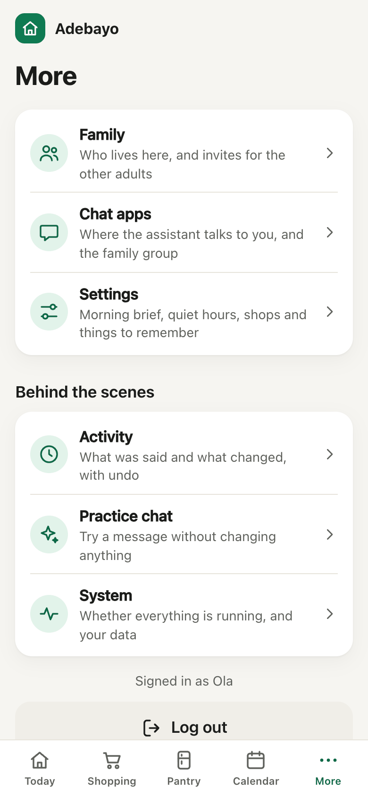
  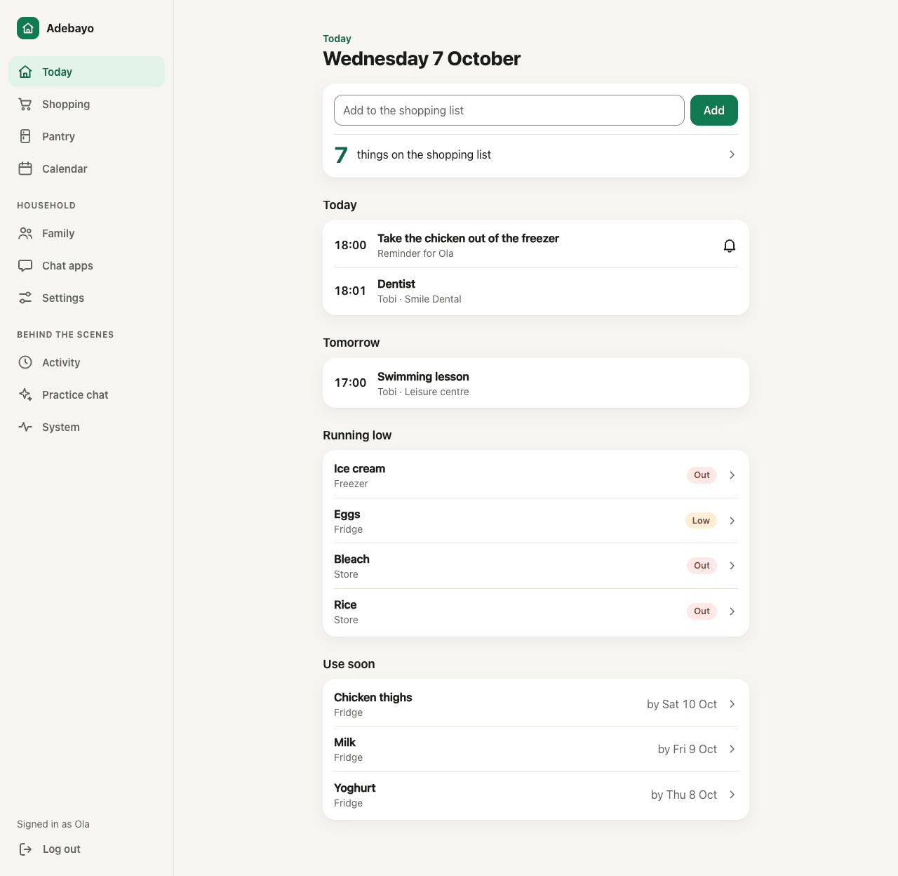

Each screen has one main thing to do, and a list reads as a list: what a row can change (its shop,
its time, its quiet hours) opens when the row is tapped. Pages say things in the family's words,
not the database's: "Running low", "every week on Tue, Thu", "Not delivered". The words are in
`app/dashboard/words.py`. Light and dark follow the system setting.

Three pages are named differently here than in the code and in the other documents, and their
paths have not changed: **Pantry** is the inventory (`/dashboard/inventory`), **Chat apps** is the
channels page (`/dashboard/channels`) and **Practice chat** is the Playground
(`/dashboard/playground`).

There is still no build step ([ADR 0005](adr/0005-htmx-dashboard-instead-of-spa.md)): one
hand-written stylesheet, `static/app.css`; icons drawn as inline SVG; and `static/app.js`, about
forty lines that pick the device's time zone on `/setup`, copy a link or code when Copy is pressed,
and say so when a request fails. Every page works without that script. Colours meet WCAG AA
contrast in both modes, every control is at least 44 px tall, and focus is always visible.

## First run

Open `/setup?token=<SETUP_TOKEN>` while no household exists. Step one asks for a first name and a
name for the household. The time zone is a list with `DEFAULT_TIMEZONE` chosen, which the page
replaces with the device's own zone where the browser gives one. Submitting creates the household
with locations `fridge`, `freezer` and `store`.

Step two is the admin's invite, shown once: a button that opens Telegram with the code already in
it, a QR code of the same link for another phone, and the code itself to send by hand. After that
`/setup` returns 404.

  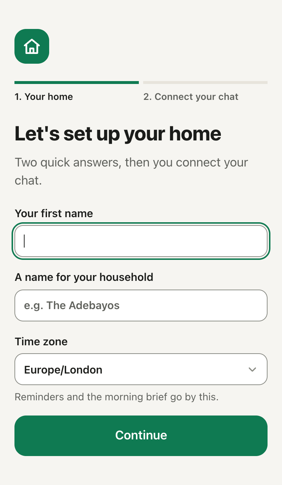
  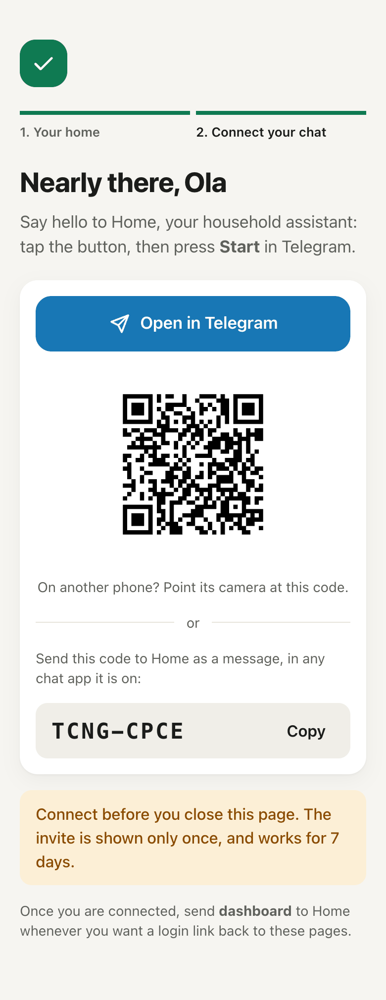

## Login

No passwords. A connected adult sends `dashboard` to the bot. The pipeline answers that exact
keyword itself (no model call) with a DM containing `/login/{token}`: 32 random bytes, stored
hashed, valid 10 minutes, single use, 5 per member per hour. Opening it sets a signed, HttpOnly,
SameSite=Lax cookie for 30 days (Secure when `PUBLIC_BASE_URL` is https) carrying the member id and
`members.session_version`. `POST /logout?everywhere=1` bumps that version and ends every session.
Children never get logins.

Anyone without a session gets a page that lists those steps and, when `TG_BOT_USERNAME` is set, a
button that opens the chat in Telegram.

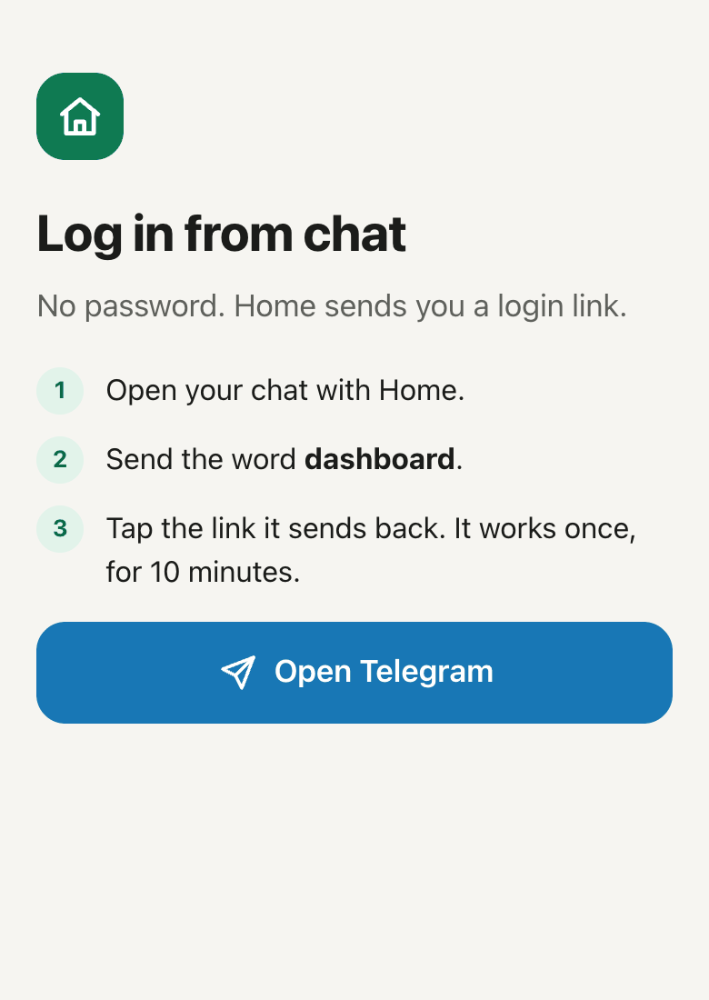

Every POST carries a CSRF token derived from `SESSION_SECRET` and the session, in the
`X-CSRF-Token` header (set once on `<body>` via `hx-headers`) or a `csrf` form field. A mismatch
returns 403.

## Pages

| Page | Path | Shows | Actions |
| --- | --- | --- | --- |
| Today | `/dashboard` | Shopping list count, today's and tomorrow's events and reminders, what is running low or has run out, what goes out of date within 3 days | Quick-add to the list |
| Shopping list | `/dashboard/shopping` | Active list, then "You might also need" | Add, tick off with the circle, remove, set the shop |
| Pantry | `/dashboard/inventory` | Stock by location, filter by status; per-item history | Set a count, mark none left, edit an item (other names, always kept in, low threshold, usual place), merge a duplicate |
| Calendar | `/dashboard/calendar` | The next 30 days with repeats expanded, the repeating series, standalone reminders | Add an event (once, daily, weekly or monthly), edit title, time and place, cancel, skip one date of a series, cancel a reminder, get the calendar link |
| More | `/dashboard/more` | The pages below, each with a line about what it is for | Log out |
| Family | `/dashboard/family` | Everyone in the household, each adult's connected chat apps, open invites | Add an adult or a child, make a new invite (button, QR code and code, shown once), cancel an invite, choose which connected chat app an adult is messaged on |
| Chat apps | `/dashboard/channels` | Each channel: whether it is set up, when it last heard from and sent to the family, sends failed in the last day, and for iMessage since when it has been unreachable. Each chat: whose it is, the main family chat, and for WhatsApp whether any message or only the standard reminder will be delivered | Create a WhatsApp group, forget one that was never confirmed, show a group's invite link and QR code, choose the main family chat |
| Activity | `/dashboard/activity` | The last 200 turns and dashboard actions as a conversation: what was said, the reply and whether it was delivered, and what changed. An admin also gets "Technical details" on each: tool calls and results, tokens, latency, the error of a failed turn | Undo a change, send a failed reply again |
| Practice chat | `/dashboard/playground` | A chat with the agent in the browser | A practice run by default; tick "Save it for real" to keep the result |
| Settings | `/dashboard/settings` | The morning brief time, each adult's quiet hours, whether each adult has a link for arriving at a shop, places and their kinds, things to remember | Change the brief time, change or clear quiet hours, make or replace a link, add a place or change its kind, add, change or forget a fact |
| System (admin only) | `/dashboard/system` | Whether the worker is alive, the newest runs of the once-a-day jobs, the runtime, provider and model, the last eval result, whether stock matches the event log, the version and migration | Rebuild stock from the event log, download everything as JSON |

  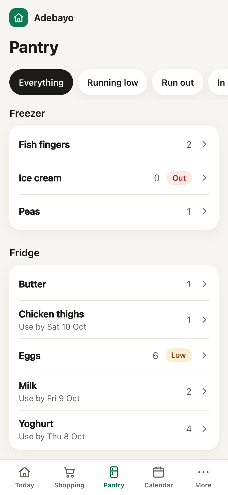
  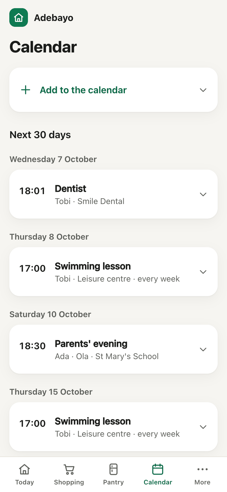
  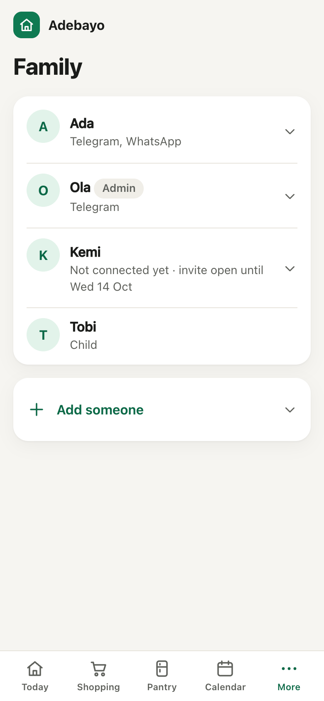

  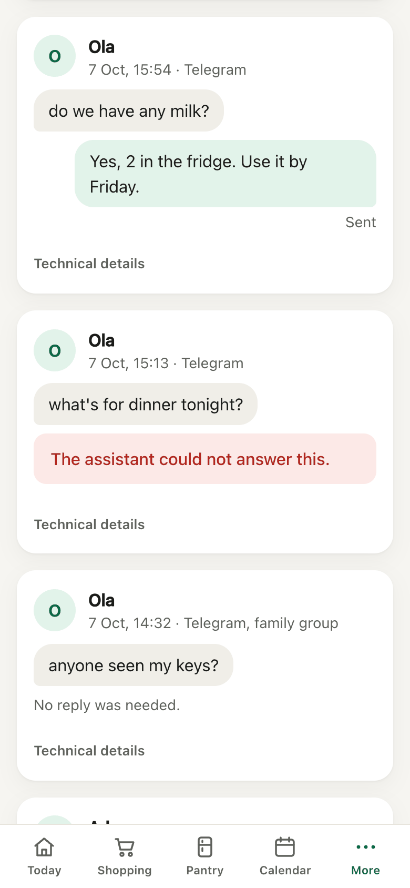
  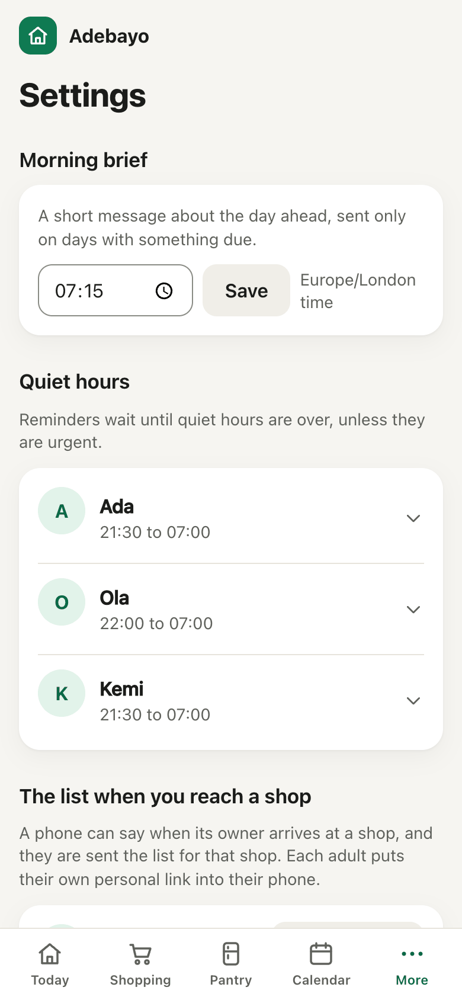

Reminders are added in chat; the Calendar page lists
and cancels them. "Always keep this in" (a staple) is set on an item's page. The calendar link
stays on the Calendar page.

## Presence links and places

"The list when you reach a shop" on Settings lists each adult with "has a link" or "no link yet".
"Make link" or "Replace link" creates a new personal link and shows it once, to be sent to that
person; only its hash is stored, so it cannot be shown again, and replacing it stops the old link
working. Any adult can make a link for any adult, as with invites. Someone without a link can also
get theirs by sending the word `shops` in chat. The steps for the phone are not on Settings: they
are on the page the link opens ([presence.md](presence.md#setting-it-up-one-shop-at-a-time)).

"Places" lists what the assistant knows by name: the shops said during setup, anything added
here, and any name a phone has sent. Only a place of kind `store` sends its list on arrival, and
only `home` counts for "out and about", so a place that appeared as `other` needs its kind set
here. Changing a kind is logged in Activity and can be undone; making a link is logged and cannot.

## Inviting the family

Adding an adult on the Family page creates the member and shows their invite once: a Telegram deep
link behind "Open in Telegram", a QR code of it, and the code itself, which can be sent to the bot
on any connected channel. It is the same invite the setup page ends on. Only the code's hash is
stored. It works once per channel and for 7 days; "New invite" replaces it and "Cancel the invite"
ends it. Both are behind the person's row, which opens when tapped. The same happens from chat:
tell the assistant another adult lives there and it sends you the invite to pass on. When they open
it their chat is linked, it becomes their preferred channel, and they can send `dashboard` to log
in themselves. Children are records only: no chat, no login, no quiet hours.

Quiet hours are on Settings rather than Family, next to the brief time they belong with. A fact
named `shops` or `main_supermarket` also becomes a shop in `places`. The keys `staples`,
`morning_brief` and `quiet_hours` are settings, not facts, and are refused in the facts form
([ADR 0016](adr/0016-settings-said-in-chat-go-through-remember.md)).

## Chat apps and the family group

What is addressed to the whole household (the morning brief, a reminder for a child's activity)
goes to the main family chat: the first group a connected member writes in, or the one chosen with
"Make main chat". With no group, each adult gets it by DM.

"Create group" asks WhatsApp for a group with the given name. WhatsApp creates it a moment later
and tells the api by webhook; until then the page shows it as "being created", and once it exists
it is the main family chat. If the confirmation never comes, "Forget" drops the request so it can
be made again. "Invite link" then asks WhatsApp for the group's link and shows it
with a QR code. The link is fetched each time and never stored. Each adult opens it to join, since
WhatsApp does not let a business add people to a group. Anyone holding the link can join, so pass
it on privately ([ADR 0021](adr/0021-whatsapp-groups-are-created-asynchronously.md)).

To use a group that already exists on Telegram, add the bot to it and write something there.

Moving someone's DMs to another channel is on the Family page: tap a person with more than one
connected chat app, choose under "Message Ada on" (their name) and save. Nothing else needs
changing.

## System

Only a member with `is_admin` (whoever ran `/setup`) gets the System link, in the sidebar and on
More, and the page, the export and the rebuild answer 403 to anyone else. This page keeps the
system's own words (`job_runs`, the provider's name, the event log): it is for whoever looks after
the installation.

- **Worker.** The worker writes a heartbeat every minute. The page says "Running" with the time
  of the last one, or that the worker is probably not running once the last is more than three
  minutes old. Nothing is answered, sent or reminded while the worker is down.
- **Job runs.** The 30 newest runs of the jobs that happen once a day or week (`daily_brief`,
  `weekly_digest`, `consumption_model`, `low_stock_prompt`), from `job_runs`. Messages, sends and
  reminders are handled continuously and leave no row; they show on Activity.
- **Model.** `AGENT_RUNTIME`, `LLM_PROVIDER`, the endpoint's host (or that the provider is a CLI
  on a subscription sign-in), `LLM_MODEL`, `LLM_FAST_MODEL` when set, and whether photos are
  read. Never a key. When the household's newest handled message failed, its error is shown
  first: with a subscription provider that is where an expired sign-in or a used-up allowance
  appears. It goes once a later message is answered.
- **Last eval result.** For each provider, what the eval suite last wrote into
  `EVAL_RESULTS_DIR` (default `tests/evals/.results`): passed of total, the model, when, and the
  cases that failed. The suite writes there on the machine where it is run, so a deployed image
  shows "No eval result on this machine" unless the files are put there.
- **Stock check.** Replays the inventory event log and compares the result with the `stock` table,
  row by row: status, quantity and expiry date. They should always agree, because stock is only
  written with its event. A difference is listed with both sides. "Rebuild stock from the event
  log" replaces the table with the replay (`POST /dashboard/system/rebuild-stock`, answers 202).
  A rebuild that changed something is logged in Activity and can be undone there.
- **Export.** `GET /dashboard/system/export` downloads one JSON file with every table's rows for
  this household. Token hashes and one-time login links are left out. It contains every message
  and photo reference, so keep it private.
- **Version.** The version from `pyproject.toml` and the database's migration.

One known false alarm: changing an item's low threshold changes how its old events replay, so the
check can show that item as different until the next event or a rebuild.

## Calendar feed

"Get a calendar link" on the Calendar page creates a link of the form `/ics/{token}.ics` for Apple
or Google Calendar. The token is 32 random bytes and only its SHA-256 is stored, so the link is
shown once; making a new one stops the old one working. The feed is read-only: one `VEVENT` per
active event, `DTSTART` with the household `TZID`, the `RRULE` and exception dates passed through,
`UID` `{event_id}@household-agent`, and a 15-minute `Cache-Control`. It carries no `VTIMEZONE`
block ([ADR 0015](adr/0015-ics-feed-token-and-time-zones.md)).

## How writes work

Pages never write SQL. A write calls the same `app/services/` function the agent tool uses, inside
`record(...)` with `source = 'dashboard'`, so stock rules, undo and the Activity log behave exactly
as they do from chat. Ticking an item's circle in the browser logs a restock, just as "got the
eggs" does. Brief time, quiet hours, facts, added members and the preferred channel can be undone
from Activity. Creating or revoking an invite, creating a group and choosing the main family chat
are logged but not undoable, and a member who has connected can no longer be removed by undo.

Practice chat calls `simulate_turn()`, the same service the eval suite uses. A practice run executes
the whole turn in a transaction and rolls it back, so nothing is saved and each practice message
starts without memory of the last one.

Merging duplicates reassigns events, stock, list entries and aliases to the kept item in one
transaction and cannot be undone.
